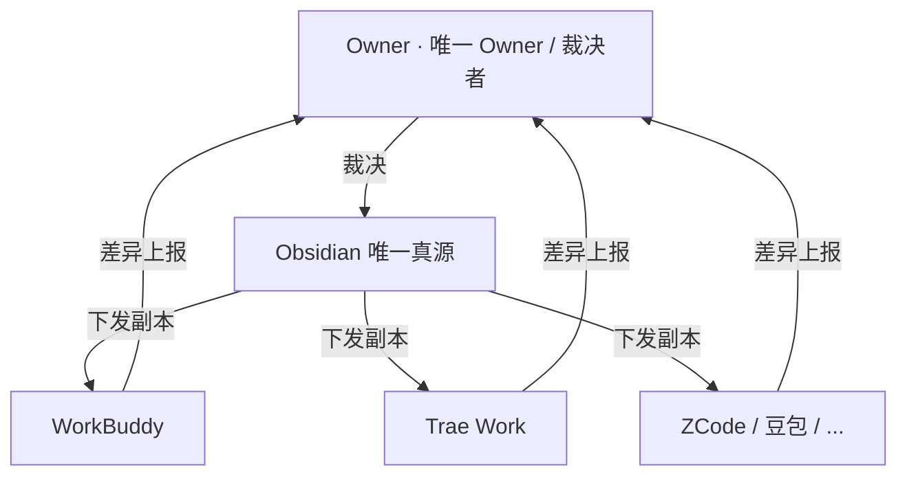

# AgentUnify

> **多智能体统一规则体系** —— 一套规则，统御所有智能体。

让本机多个 AI 工具（WorkBuddy / Trae Work / ZCode / 豆包 …）共用**同一份人设、规则和记忆**，只维护一个真源。从「各写各的、改一处漏一处」，变成「改一处、处处同步」。

## 核心机制

- **星型拓扑**：Obsidian 当唯一真源，各工具只留本地副本
- **真源中立化**：一套规则写占位符（`{RULES_DIR}` 等），下发时自动翻译成各工具自己的路径
- **比对-裁决**：脚本只做确定的事，冲突永远留人拍板



## 三条铁律

1. **Owner = 唯一 Owner**：任何增删改，最终都要 Owner 批准
2. **脚本 = 机械工具**：只做 compare / check / backup / sync，不裁决
3. **AI 互审 = 平级**：可指出疑似错误并附理由，不得擅自回改

## 目录结构

```
AgentUnify/
├── AGENTS.md                  # 最高统领（规则索引 + 行为规范）
├── ai_rules_collaboration.md  # 协作规则（体系宪法，所有 AI 必读）
├── ai_rules_architecture.md   # 架构决策 + 演进史
├── 1-人设/                    # 人设（SOUL / USER / IDENTITY）
├── 2-规则/                    # 规则（懒加载）
├── 3-记忆/                    # 记忆（定期提炼汇总）
├── 4-索引/                    # 索引（脚本/AI 扫描生成）
└── _scripts/mirror.py         # 机械比对器（compare/check/backup/sync）
```

## 快速开始

```bash
# 比对真源 vs 各工具副本
python mirror.py compare

# 校验索引对齐
python mirror.py check

# 下发（只下发「仅真源有」的安全项）
python mirror.py sync --apply
```

> 详见 `ai_rules_collaboration.md`（协作规则）与 `ai_rules_architecture.md`（架构背景）。

## 版本

**v0.1.0**（当前，私有仓库）
