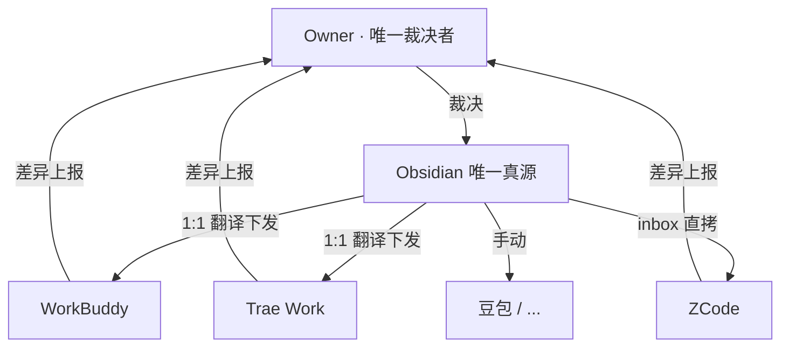

# AgentUnify

> **多智能体统一规则体系** —— 一套规则，统御所有智能体。

让本机多个 AI 工具（WorkBuddy / Trae Work / ZCode / 豆包 …）共用**同一份人设、规则和记忆**，只维护一个真源。从「各写各的、改一处漏一处」，变成「改一处、处处同步」。

## 核心机制

- **星型拓扑**：Obsidian 当唯一真源，各工具只留本地副本
- **真源中立化**：一套规则写占位符（`{RULES_DIR}` 等），下发时自动翻译成各工具自己的路径
- **三种下发形态**（v0.2.0）：
  - **1:1**：真源文件 → 副本文件（改目录/改名），WorkBuddy、Trae 走这条
  - **inbox**：真源文件原样保留子目录拷入 inbox 收件箱，由 ZCode 自己识别归位
  - **N:1 拼接**（v0.2.0 弃用）：旧版 ZCode 拼接单 AGENTS.md 方案，已被 inbox 取代
- **比对-裁决**：脚本只做确定的事，冲突永远留人拍板
- **双向遍历**（v0.2.0 加固）：副本侧孤儿（真源已删、副本还有）自动归入「仅副本有」
- **口径分层**（v0.3.1）：真源按**文件夹**切分 —— 根级 3 篇方法论可脱敏开源，4 个私人目录不进仓



## 三条铁律

1. **Owner = 唯一裁决者**：任何增删改，最终都要 Owner 批准
2. **脚本 = 机械工具**：只做 compare / check / backup / sync，不裁决
3. **AI 互审 = 平级**：可指出疑似错误并附理由，不得擅自回改

## 各工具接入策略

| 工具 | 模式 | 真源下发 | 副本维护 |
|---|---|---|---|
| WorkBuddy | 1:1 翻译下发 | 占位符 → WB 路径 | Owner 全权管 |
| Trae Work | 1:1 翻译下发 | 占位符 → Trae 路径 | Owner 全权管 |
| ZCode | inbox 直拷 | 原样保留子目录 | **ZCode 自己归位**（inbox README 三分流）|
| 豆包 / 其他 | 无本地目录 | 手动（知识库/提示词）| Owner 手动同步 |

> ⛔ **ZCode 边界铁律**：`~/.zcode/` 下所有文件是 ZCode 自己的家务事，本体系永不触碰
> （不比对 / 不下发 / 不删除 / 不修改）。本脚本只跟 inbox 收件箱交互。

## 开源边界（什么进仓）

**只开机制，不开实例** —— 本仓不携带任何人的人设、领域规则、记忆或真实路径。

判据是**按文件夹切分**、机械可判的：真源根级的 3 篇方法论（本仓根目录的
`ai_rules_architecture.md` / `ai_rules_collaboration.md` / `AI-Rules镜像同步规范.md`）
脱敏后进仓；`1-人设/` `2-规则/` `3-记忆/` `4-索引/` 四个目录内**一切**文档属私人实例，
**永不进仓** —— 本仓对这 4 个目录只留空槽位 README，请在你自己的真源里自建。

详见 `开源边界契约.md`。

## 目录结构

```
AgentUnify/
├── README.md                       # 本文件（唯一的对外说明书）
├── AGENTS.md                       # 本仓的 AI 指令骨架（怎么跑脚本 / 别提交实例）
├── 开源边界契约.md                 # 边界：什么进仓（机制）/ 什么永不进仓（实例）
├── ai_rules_collaboration.md       # 协作规则（体系宪法，所有 AI 必读）
├── ai_rules_architecture.md        # 架构决策 + 演进史
├── AI-Rules镜像同步规范.md         # 脚本命令手册与下发规范
├── CHANGELOG.md                    # 版本变更记录
├── config.example.json             # 配置样板：复制为 config.json 后改路径
├── 1-人设/ 2-规则/ 3-记忆/ 4-索引/ # 空槽位（使用者自建，勿提交私密内容）
└── _scripts/
    ├── mirror.py                   # 机械比对器（compare / check / backup / sync）
    └── memindex.py                 # 索引工具（技能清单 check / diff / gen）
```

> 上面三份核心 `.md`（协作 / 架构 / 镜像规范）属**方法论层**，由维护者的发布器
> 从真源脱敏后生成 —— 改了真源就重新发布，不靠手工维护。分工见 `开源边界契约.md`。

## 快速开始

```bash
# 1) 配置真源路径（复制样板后改路径即可，source_dir 支持 ~）
cp config.example.json config.json

# 2) 比对真源 vs 各工具副本
python _scripts/mirror.py compare

# 3) 校验索引对齐（两段：AGENTS.md 懒加载总表 + 4-索引 双链地图）
python _scripts/mirror.py check

# 4) 备份真源（写操作前自动执行一次，同一天只一次）
python _scripts/mirror.py backup

# 5) 下发：先 dry-run 看差异，再只下发「仅真源有」的安全项
python _scripts/mirror.py sync
python _scripts/mirror.py sync --apply

# 6) 技能清单：校验漂移 / 重新生成
python _scripts/memindex.py check
python _scripts/memindex.py gen
```

> 未配置 `config.json` 时，脚本会在启动自检处**直接报错指路**（不会静默跑到错误目录）。
> 「内容不同 / 仅副本有」脚本永不自动覆盖 —— 需 Owner 裁决后加 `--take-ob` 才执行。

> 详见 `AI-Rules镜像同步规范.md`（同步规范）与 `ai_rules_collaboration.md`（协作规则）。

## 版本

**v0.3.1**（当前）：真源口径分层（根级 3 篇方法论可开源 / 4 个私人目录不进仓）+ 发布器覆盖方法论 md（含路径翻译）＋ 清除 N:1 拼接死代码（`merged_bytes` / `MERGE_SEP` / `merge` 配置 / `merges` 字段）+ 修正 `report` docstring

**v0.3.0**：稳定性加固（命令白名单 / 前置校验 / 写后复核）+ `memindex.py` 索引工具 + `config.json` 配置机制 + 行尾归一

> 详见 `CHANGELOG.md`。
