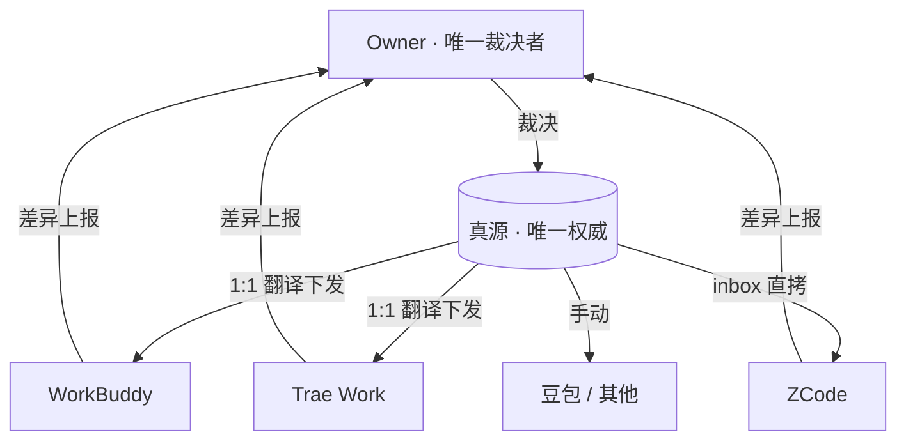

<div align="center">

# AgentUnify

**一套规则，统御所有智能体**

让本机多个 AI 工具共用同一份人设、规则与记忆 —— 只维护一个真源。

[](CHANGELOG.md)
[](LICENSE)
[](_scripts/mirror.py)
[](.gitattributes)

</div>

---

## 这是什么

如果你同时用 WorkBuddy、Trae、ZCode、豆包…… 你会遇到同一个问题：

> **每个 AI 都要配一份人设和规则，改一处就要改 N 处；过几天它们悄悄跑偏了，谁也不知道。**

AgentUnify 把这堆散落的配置文件收拢成**一颗星**：中间一个**唯一真源**，各工具只留派生副本。真源改一处，其余按规则同步。

它不绑定任何具体工具 —— 你用什么 AI，它管什么 AI。

---

## 它解决什么问题

| 痛点 | 没有统一体系 | 本体系的做法 |
|:--|:--|:--|
| **多处维护** | N 个工具写 N 份人设/规则，改一处漏一处 | 只维护**一个真源**，其余是派生物 |
| **静默漂移** | 副本悄悄跑偏，无人察觉 | `compare` 机械比对，逐条列出差异 |
| **误覆盖** | 脚本"自动同步"把好内容冲掉 | 脚本**只比对不裁决**，冲突一律交人拍板 |
| **记忆割裂** | 各 AI 各记各的，互相不知道 | 记忆定期**提炼汇总**回真源 |
| **换工具成本** | 重新配一遍 | 接入 = 加一条映射 |

---

## 核心机制

**① 星型拓扑** —— 真源在中心，工具在四周。工具有改动先**上报差异**，由 Owner 裁决后写回真源。



**② 真源中立化** —— 真源里写占位符（如 `{RULES_DIR}`），下发时自动翻译成各工具自己的路径。写规则的人不用关心谁用在哪。

**③ 三种下发形态**

| 形态 | 做法 | 适用 |
|:--|:--|:--|
| **1:1 翻译** | 真源文件 → 副本文件（可改目录/改名） | WorkBuddy、Trae Work |
| **inbox 直拷** | 原样保留子目录拷进收件箱，由目标自己归位 | ZCode |
| **手动** | 无本地目录，靠人贴 | 豆包等 |

**④ 比对-裁决** —— 脚本只做确定的事：列出「仅真源有 / 仅副本有 / 内容不同」。**永不自动覆盖**冲突项。

**⑤ 双向遍历** —— 副本侧的孤儿文件（真源已删、副本还在）也会被抓出来，不会成为盲区。

---

## 三条铁律

> **一、Owner = 唯一裁决者**
> 任何规则、人设、记忆的增删改，最终都要人批准。没有脚本能绕过。
>
> **二、脚本 = 机械工具**
> 只做 `compare` / `check` / `backup` / `sync`，**不裁决**。脚本永远不替你做决定。
>
> **三、AI 互审 = 平级**
> 各 AI 之间可以指出疑似错误并附理由，但**不得擅自回改**，须交 Owner 审核。

---

## 快速开始

```bash
# 1）配置真源路径（复制样板后改路径即可）
cp config.example.json config.json

# 2）看看真源和副本差在哪（只读，不改任何文件）
python _scripts/mirror.py compare

# 3）校验索引是否对齐（懒加载总表 + 双链地图）
python _scripts/mirror.py check

# 4）下发前先 dry-run，确认要动什么
python _scripts/mirror.py sync

# 5）只下发「仅真源有」这类确定安全的项
python _scripts/mirror.py sync --apply
```

> **提示**：未配置 `config.json` 时，脚本会在启动自检处**直接报错指路**并以 `exit 2` 退出，不会静默跑到错误目录。

---

## 命令速查

### `mirror.py` —— 真源 ↔ 副本 机械比对器

| 命令 | 作用 | 是否写文件 |
|:--|:--|:--:|
| `compare` | 比对真源与各副本，输出三类差异 | 否 |
| `check` | 校验索引对齐（懒加载总表 + 双链地图） | 否 |
| `backup` | 备份真源（同一天只备份一次） | 是 |
| `sync` | dry-run：显示将要下发什么 | 否 |
| `sync --apply` | 下发「仅真源有」 | 是 |
| `sync --apply --take-ob` | Owner 裁决后，覆盖「内容不同」 | 是 |
| `report` | 生成差异报告（无论有无差异都写盘，便于留痕） | 是 |

### `memindex.py` —— 索引层工具

| 命令 | 作用 |
|:--|:--|
| `check` | 校验技能清单与技能目录是否一致 |
| `diff` | 只显示差异项 |
| `gen` | 重新生成技能清单（机械再生，杜绝手工漂移） |

> 「内容不同 / 仅副本有」两类**脚本永不自动处理**，需 Owner 裁决后加 `--take-ob` 才执行。

---

## 各工具接入策略

| 工具 | 副本位置 | 下发模式 | 副本维护 |
|:--|:--|:--|:--|
| WorkBuddy | `~/.workbuddy/` | 1:1 翻译下发 | Owner 全权管 |
| Trae Work | `~/.trae-cn/` | 1:1 翻译下发 | Owner 全权管 |
| ZCode | `~/.zcode/workspace/default/inbox/` | inbox 直拷 | **ZCode 自己归位** |
| 豆包 / 其他 | 无本地目录 | 手动 | Owner 手动同步 |

> ⛔ **ZCode 边界铁律**：`~/.zcode/` 下**除 inbox 外**的文件是 ZCode 自己的家务事 ——
> 本体系**永不触碰**（不比对 / 不下发 / 不删除 / 不修改）。

---

## 配置说明

`config.json`（从 `config.example.json` 复制，**不入版本库**）：

| 字段 | 必填 | 说明 |
|:--|:--:|:--|
| `source_dir` | ✅ | 真源文档目录 —— 你存放规则/人设/记忆 md 的根目录，支持 `~` |
| `skills_dir` | — | 技能目录（`memindex.py` 扫描 `SKILL.md` 的来源），支持 `--skills-dir` 覆盖 |

---

## 目录结构

```
AgentUnify/
├── README.md                       # 本文件（唯一的对外说明书）
├── AGENTS.md                       # 本仓的 AI 指令骨架 + 文档索引（懒加载）
├── 开源边界契约.md                 # 边界：什么进仓（机制）/ 什么永不进仓（实例）
├── LICENSE                         # MIT
├── CHANGELOG.md                    # 版本变更记录
├── config.example.json             # 配置样板：复制为 config.json 后改路径
│
├── ai_rules_collaboration.md       # 方法论 · 协作规则（体系宪法，必读）
├── ai_rules_architecture.md        # 方法论 · 架构决策 + 演进史
├── AI-Rules镜像同步规范.md         # 方法论 · 脚本命令手册与下发规范
│
├── 1-人设/ 2-规则/ 3-记忆/ 4-索引/ # 空槽位：使用者自建，勿提交私密内容
└── _scripts/
    ├── mirror.py                   # 机械比对器（compare / check / backup / sync）
    └── memindex.py                 # 索引工具（技能清单 check / diff / gen）
```

> 上面三份 `方法论 ·` 文档由维护者的**发布器**从真源脱敏后生成 —— 改真源即重新发布，不靠手工维护。

---

## 开源边界

**只开机制，不开实例。** 判据是**按文件夹切分**、机械可判、零裁量的：

| 真源位置 | 定性 | 去向 |
|:--|:--|:--|
| 仓根 3 篇方法论 | 框架层 | ✅ 脱敏后进仓 |
| `1-人设/` `2-规则/` `3-记忆/` `4-索引/` 内**一切**文档 | 实例层 | ⛔ **永不进仓** |

本仓对这 4 个目录**只留空槽位 README** —— 请在你自己的真源里自建。

**判定口诀**：*换个陌生人拿到它，需要改哪些地方才能跑起来？*
需要改的 = 实例（挪出仓）；不用改的 = 机制（可进仓）。

详见 [`开源边界契约.md`](开源边界契约.md)。

---

## 文档索引

| 文档 | 讲什么 |
|:--|:--|
| [`ai_rules_collaboration.md`](ai_rules_collaboration.md) | 协作规则（体系宪法）：唯一真源、三类文件治理、编辑铁律、冲突裁决、记忆提炼 |
| [`ai_rules_architecture.md`](ai_rules_architecture.md) | 架构决策与演进史：星型拓扑、口径分层、演进 1–9 |
| [`AI-Rules镜像同步规范.md`](AI-Rules镜像同步规范.md) | 脚本命令手册 + 三种下发形态 + ZCode 边界铁律 + 双向遍历 |
| [`开源边界契约.md`](开源边界契约.md) | 什么进仓 / 什么永不进仓 + 判定口诀 |
| [`AGENTS.md`](AGENTS.md) | 本仓的 AI 指令骨架与文档索引（懒加载总表） |

---

## 版本历史

| 版本 | 日期 | 变更 |
|:--|:--|:--|
| [v0.3.1](https://github.com/wolfjkd/AgentUnify/releases/tag/v0.3.1) | 2026-09-14 | 真源口径分层（文件夹即判据）；方法论文档纳入自动发布；清除 N:1 拼接死代码；修正 `report` 文档 |
| [v0.3.0](https://github.com/wolfjkd/AgentUnify/releases/tag/v0.3.0) | 2026-09-14 | 稳定性加固（命令白名单 / 前置校验 / 写后复核）；新增 `memindex.py`；配置外置 `config.json` |
| [v0.2.0](https://github.com/wolfjkd/AgentUnify/releases/tag/v0.2.0) | 2026-09-13 | 4 工具标准化接入；ZCode 改 inbox 模式；副本双向遍历加固 |
| [v0.1.0](https://github.com/wolfjkd/AgentUnify/releases/tag/v0.1.0) | 2026-09-13 | 首个开源版本：真源-副本比对器 + 索引校验 |

> 完整变更记录见 [`CHANGELOG.md`](CHANGELOG.md)。

---

## License

[MIT](LICENSE) © 2026 wolfjkd

<div align="center">
<sub>它不生产规则，它只是规则的搬运工 —— 但搬得一丝不苟。</sub>
</div>
