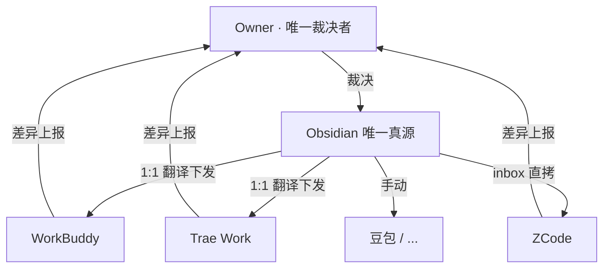

# AgentUnify

> **多智能体统一规则体系** —— 一套规则，统御所有智能体。

让本机多个 AI 工具（WorkBuddy / Trae Work / ZCode / 豆包 …）共用**同一份人设、规则和记忆**，只维护一个真源。从「各写各的、改一处漏一处」，变成「改一处、处处同步」。

## 核心机制

- **星型拓扑**：Obsidian 当唯一真源，各工具只留本地副本
- **真源中立化**：一套规则写占位符（`{RULES_DIR}` 等），下发时自动翻译成各工具自己的路径
- **三种下发形态**（v0.2.0）：
  - **1:1**：真源文件 → 副本文件（改目录/改名），WorkBuddy、Trae 走这条
  - **inbox**：真源文件原样保留子目录拷入 inbox 收件箱，由 ZCode 自己识别归位
  - **N:1 拼接**（v0.2.0 弃用）：旧版 ZCode 拼接单 AGENTS.md 方案，已被 inbox 取代
- **比对-裁决**：脚本只做确定的事，冲突永远留人拍板
- **双向遍历**（v0.2.0 加固）：副本侧孤儿（真源已删、副本还有）自动归入「仅副本有」



## 三条铁律

1. **Owner = 唯一裁决者**：任何增删改，最终都要 Owner 批准
2. **脚本 = 机械工具**：只做 compare / check / backup / sync，不裁决
3. **AI 互审 = 平级**：可指出疑似错误并附理由，不得擅自回改

## 各工具接入策略

| 工具 | 模式 | 真源下发 | 副本维护 |
|---|---|---|---|
| WorkBuddy | 1:1 翻译下发 | 占位符 → WB 路径 | Owner 全权管 |
| Trae Work | 1:1 翻译下发 | 占位符 → Trae 路径 | Owner 全权管 |
| ZCode | inbox 直拷 | 原样保留子目录 | **ZCode 自己归位**（inbox README 三分流）|
| 豆包 / 其他 | 无本地目录 | 手动（知识库/提示词）| Owner 手动同步 |

> ⛔ **ZCode 边界铁律**：`~/.zcode/` 下所有文件是 ZCode 自己的家务事，本体系永不触碰
> （不比对 / 不下发 / 不删除 / 不修改）。本脚本只跟 inbox 收件箱交互。

## 目录结构

```
AgentUnify/
├── AGENTS.md                       # 最高统领（规则索引 + 行为规范）
├── ai_rules_collaboration.md       # 协作规则（体系宪法，所有 AI 必读）
├── ai_rules_architecture.md        # 架构决策 + 演进史
├── 1-人设/                         # 人设（SOUL / USER / IDENTITY）
├── 2-规则/                         # 规则（懒加载）
│   └── AI-Rules镜像同步规范.md     # mirror.py 命令、机制、铁律
├── 3-记忆/                         # 记忆（定期提炼汇总）
├── 4-索引/                         # 索引（脚本/AI 扫描生成）
└── _scripts/mirror.py              # 机械比对器（compare/check/backup/sync）
```

## 快速开始

```bash
# 比对真源 vs 各工具副本
python mirror.py compare

# 校验索引对齐（AGENTS.md 引用 ↔ 2-规则/ 文件）
python mirror.py check

# 备份真源（每次运行前自动执行一次）
python mirror.py backup

# 下发（只下发「仅真源有」的安全项）
python mirror.py sync --apply

# 只针对某个工具下发
python mirror.py sync --apply zcode
```

> 详见 `2-规则/AI-Rules镜像同步规范.md`（同步规范）与 `ai_rules_collaboration.md`（协作规则）。

## 版本

**v0.2.0**（当前）：4 工具标准化接入 + inbox 模式 + 双向遍历加固 + sync 命令补齐

> 详见 `CHANGELOG.md`。